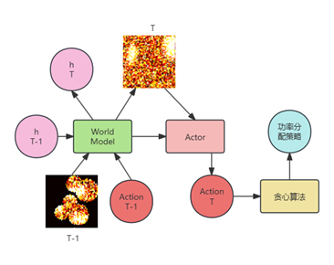

# 基于强化学习的无人机基站动态部署优化

## 第一章 绪论

### 1.1 课题研究背景及意义

在城市中某一区域开展某些活动会聚集大量人群从而造成移动网络的拥堵。如果针对各种活动去部署固定的基站会产生很大的开销，并且在不举办活动时产生浪费。随着无人机基站的成熟，使用无人机基站对这样人群密集的户外场景进行移动网络覆盖是一个非常经济的选择。然而人群在某一区块的分布是不均匀的，并且会随时间发生变化，同时无人机的电池容量也是有限的。在这种背景下怎样合理地分配并且动态调整无人机的位置，以配合地面基站以最低的功耗服务最多的用户。

### 1.2 国内外研究现状

- 单个无人机，没有多个无人机的协作，没有对未来用户需求变换的预测，没有对高度进行优化。
- 用户位置固定，只会做初始无人机位置和功率的优化而不是动态调整。
- 用户位置固定，并且有预设的集群。
- 同时以上三个方案的潜在前提都是可以完整掌握用户的位置信息。

## 第二章 无人机基站位置和功率优化算法

### 2.1 无人机基站的限制和优化目标

### 2.2 无人机基站位置和功率优化算法

### 2.3 常用强化学习算法

## 第三章 基于模型的强化学习算法的无人机基站动态部署优化方法

### 3.1 引言

&emsp;&emsp;目前无人机基站的位置和用户分配问题是无人机基站部署中的重要问题。合理的无人机基站位置和功率分配不但可以提高网络的覆盖率，还可以降低网络的功耗，延长无人机的续航时间。但是在人群密集的场景中，获得完整的人群分布信息是非常困难的，同时人群的分布是随时间变化的，所以需要无人机基站根据每个无人机获得的人群密度信息进行整合和预测，综合当前的人群分布信息和历史信息，对未来的人群分布进行调整。动态调整自身的位置和功率分配，以实现最优的覆盖效果。因此，本文提出了一种新型的World Model，该模型可以根据对人群有限的观测信息，对人群的分布进行预测。该模型将观测位置和观测的人群密度信息进行结合，同时分析人群的内在移动规律，根据人群的规律和密度提炼出特征矩阵，以便后续的强化学习算法通过特征矩阵对无人机的位置进行规划。

&emsp;&emsp;现有的无人机优化算法往往将人群位置保持不动而让位置优化算法针对当前的人群分布提出一个最佳的无人机位置。而针对现实情况中的人群不断变化的情况下，动态调整无人机的位置，这样的场景下必须保证整个过程中无人机的位置都能保持最优。这就对强化学习网络能够以长时间的尺度对人群的变化过程和无人机的位置变化进行规划。为了解决上述问题，本文设计了一种基于模型的强化学习算法，其中world model不但对人群的分布进行预测，还可以根据Actor给出的无人机位置结合人群密度信息去推测其能够获得的奖励，而Critic则对整个预测的过程进行评估，以此实现强化学习网络具有大时间尺度的视角，实现无人机基站动态部署优化。

&emsp;&emsp;由于场景中人群的数量很大，让强化学习算法直接指定每个用户和无人机的链接关系会让输出向量维度过大，需要大规模的Actor网络来实现。而较大规模的网络需要很高的计算性能并且具有较低的实时性。所以需要本文设计了一种贪心算法对每个用户的发射功率进行分配，以实现最大化服务的用户数量的同时最小化总发射功率。

&emsp;&emsp;综上所述，本文提出了一种基于模型的强化学习算法，该方法可以World Model对人群密度进行预测，通过Actor-Critic对无人机位置进行规划，通过贪心算法对每个用户的发射功率进行分配，以实现无人机基站动态部署优化。

### 3.2 无人机基站动态部署系统模型和优化目标

#### 3.2.1 系统模型

&emsp;&emsp;在本文的场景中，系统模型中包括多个无人机（UAVs）和多个用户（Users）。每个无人机负责为指定区域内的用户提供服务。无人机的位置需要进行动态调整，确保能够为用户提供足够的信号覆盖，并最小化功耗。用户始终处于地面上，因此其位置仅在二维平面内。目标是通过优化无人机的空间位置、功率分配等，满足用户的服务需求并最大化系统的整体效能。

&emsp;&emsp;系统中有 $ N $ 个无人机和 $ M $ 个用户。每个无人机的位置用三维坐标表示，定义为 $ \mathbf{p}_i = (x_i, y_i, z_i) $，其中 $ (x_i, y_i, z_i) $ 分别表示第 $ i $ 个无人机在三维空间中的坐标（$ x_i, y_i $ 为无人机在地面上的位置，而 $ z_i $ 为无人机的高度）。假设每个用户都位于地面上，用户的位置可以用二维坐标表示，定义为 $ \mathbf{q}_j = (x_j, y_j) $，其中 $ (x_j, y_j) $ 表示第 $ j $ 个用户的地面坐标。

&emsp;&emsp;每个无人机与每个用户之间的距离可以通过三维欧几里得距离来计算，公式如下：

$$
d_{ij} = \sqrt{(x_i - x_j)^2 + (y_i - y_j)^2 + (z_i)^2}
$$

&emsp;&emsp;其中，$ d_{ij} $ 表示第 $ i $ 个无人机与第 $ j $ 个用户之间的空间距离。

&emsp;&emsp;每个用户的功率需求与其与无人机的距离以及服务质量要求相关。假设每个用户的最小服务功率为 $ P_{\text{min}, j} $，并且该需求与无人机的接收信号强度、路径损耗等因素有关。无人机与用户之间的信道容量 $ C_{ij} $ 可以表示为：

$$
C_{ij} = B \log_2 \left( 1 + \frac{P_{i}}{N_0 d_{ij}^\alpha} \right)
$$

&emsp;&emsp;其中，$ B $ 为带宽，$ P_i $ 为第 $ i $ 个无人机的发射功率，$ N_0 $ 是噪声功率谱密度，$ \alpha $ 是路径损耗指数。为确保每个用户的带宽需求得到满足，必须满足以下条件：

$$
C_{ij} \geq C_{\text{min}, j}
$$

&emsp;&emsp;其中，$ C_{\text{min}, j} $ 为用户 $ j $ 的最小服务信道容量要求。

&emsp;&emsp;根据此信道容量公式，为了满足用户的最小功率需求 $ P_{\text{min}, j} $，我们需要确保无人机的发射功率满足以下条件：

$$
P_{i} \geq P_{\text{min}, j} \cdot d_{ij}^\alpha
$$

&emsp;&emsp;无人机的发射功率 $ P_i $ 受到最大功率 $ P_{\text{max}} $ 的限制，即：

$$
P_i \leq P_{\text{max}}, \quad \forall i \in \{1, 2, \dots, N\}
$$

&emsp;&emsp;此外，所有无人机的移动也受到速度限制，假设无人机的最大速度为 $ V_{\text{max}} $，则无人机在时间步 $ t $ 内的位移应满足以下条件：

$$
\|\mathbf{p}_i(t+1) - \mathbf{p}_i(t)\| \leq V_{\text{max}} \Delta t
$$

&emsp;&emsp;其中，$ \Delta t $ 为每个控制周期的时长，表示无人机的最大移动距离。

&emsp;&emsp;每个用户需要保证其信道容量满足最小服务质量要求，即每个用户的信道容量 $ C_{ij} $ 必须大于其预设的最小服务容量 $ C_{\text{min}, j} $，即：

$$
C_{ij} \geq C_{\text{min}, j}, \quad \forall j \in \{1, 2, \dots, M\}
$$

#### 3.2.2 优化目标

&emsp;&emsp;系统的主要目标是通过优化无人机的位置、功率分配以及服务覆盖范围，最大化系统效能。具体目标包括：

- **最大化服务的用户数量**：确保每个用户的信号质量满足其带宽需求。
- **最小化总功率消耗**：优化每个无人机的功率分配，以降低能量消耗。

&emsp;&emsp;系统的目标可以表示为：

$$
\text{Maximize } \sum_{j=1}^{M} \mathbb{\lambda_1}(C_{ij} \geq C_{\text{min}, j}) - \lambda_2 \sum_{i=1}^{N} P_i
$$

&emsp;&emsp;其中，第一项表示满足最小服务质量的用户数量；第二项是总功率消耗；$ \lambda_1 $ 和 $ \lambda_2 $ 是调节服务人数和功率的权重系数。

### 3.3 基于模型的强化学习的无人机基站位置动态优化框架

&emsp;&emsp;本节提出了一种融合主动推理与强化学习的动态部署优化框架，其核心由两部分协同工作：

- 环境预测模块（World Model），通过主动推理预测人群密度动态变化；
- 策略优化模块（Actor-Critic），基于预测结果规划无人机长期移动策略；

#### 3.3.1 基于模型的强化学习

&emsp;&emsp;基于模型的强化学习（Model-Based Reinforcement Learning, MBRL）通过显式构建环境动态模型（如状态转移函数和奖励函数）来指导智能体决策，其核心在于利用模型进行规划或生成虚拟数据以提升样本效率。MBRL在自动驾驶、机器人控制和游戏AI中表现突出，例如通过模型模拟交通场景预判风险，或结合蒙特卡洛树搜索（MCTS）实现多步博弈推演。其优势在于​​高样本效率​​（减少真实环境交互）、​​可解释性​​（模型显式表达状态转移逻辑），但面临​​模型误差累积​​（预测偏差导致策略失效）、​​计算复杂度高​​（在线规划耗时）等挑战。

&emsp;&emsp;MBRL的典型方法包括：

- 1）​​动态规划与蒙特卡洛方法​​，如策略迭代和价值迭代，适用于模型已知的静态环境；
- 2）​​模型预测控制（MPC）​​，通过在线滚动优化短期动作序列，结合强化学习提升对复杂动态的适应性；
- 3）​​基于模型的策略优化（MBPO）​​，利用神经网络拟合环境模型并生成合成数据训练策略网络；
- 4）​​层次化强化学习​​，将任务分解为子策略或子目标，通过分层规划降低决策复杂度。

&emsp;&emsp;为了对人群的变化和无人机位置变化后的能效做出预测，而人群的移动具有随机性，并且也没有理论最优的算法可以规划出无人机的最佳位置，使用​基于模型的策略优化方法比较适合解决该问题。基于模型的策略优化（MBPO）的核心特点在于利用学习的环境动态模型生成虚拟交互数据，以此替代或辅助真实环境采样。通过构建能够预测状态转移和奖励的模型，MBPO将策略优化过程与真实环境解耦，允许策略网络在合成轨迹上进行长序列训练，从而兼顾短期策略更新和长期收益规划。其模型设计通常融合随机性建模技术（如隐变量或变分推断），以捕捉环境的不确定性，增强策略在复杂动态中的泛化能力。

&emsp;&emsp;在无人机基站动态位置优化的场景中，基于模型的强化学习（MBPO）能够显著解决真实数据稀缺和隐私限制的痛点。由于实际环境中无人机飞行轨迹和用户通信数据的采集涉及隐私保护（如用户位置、信号强度等敏感信息），传统无模型强化学习依赖大量真实交互数据的模式难以实施。而MBPO通过构建虚拟环境模型（如模拟无线信道传播、用户移动模式、基站间干扰等动态），可在触及较少的隐私数据的前提下，生成大量合成轨迹用于策略训练。模型能够学习基站部署区域的用户密度变化规律，并通过多步虚拟轨迹预测无人机移动对长期网络性能的影响，使得策略在有限真实数据下仍能优化基站位置，避免因频繁试飞导致用户服务质量的下降以及隐私安全问题。

#### 3.3.2 改进的基于RSSM的环境动态预测模型

&emsp;&emsp;世界模型是基于模型的强化学习的核心模块，通过合理的世界模型设计，不但可以对环境的未来变化情况进行预测，还可以将世界模型中神经网络提取的高维信息直接输入到后面的强化学习框架中，减少Actor提取环境信息的难度。

&emsp;&emsp;循环状态空间模型（Recurrent State Space Model, RSSM）​​是强化学习中一种创新的世界建模框架，由Danijar Hafner等研究者提出，隶属于基于模型的强化学习（MBRL）范畴。其核心目标是通过学习一个紧凑的潜在状态空间，高效捕捉环境动态规律，从而支持智能体在无需频繁与环境交互的情况下进行长期规划。RSSM的架构设计融合了循环神经网络（RNN）的时序建模能力与状态空间模型的概率建模思想，主要由以下模块构成：

- 编码器（Encoder）​​：将高维观测（如图像）映射到低维潜在状态。
- ​​解码器（Decoder）​​：从潜在状态重建观测或预测奖励/终止信号。
- ​​递归模型（Recurrent Model）​​：通常采用GRU或LSTM，捕捉时序依赖关系，生成确定性状态 ht。
- ​​随机状态模型（Stochastic Model）​​：预测潜在随机变量 st，反映环境的不确定性。
- 奖励模型（Reward Model）：通过环境状态和动作预测环境返回的奖励

&emsp;&emsp;RSSM通过​​状态分解​​将潜在空间显式划分为两部分：​​确定性状态​​（ht）作为RNN的隐状态，持续传递长期记忆；​​随机状态​​（st）则捕捉当前时刻的不可预测因素（如环境随机扰动或部分可观测性）。这种分离设计既保障了长序列建模的稳定性，又赋予模型灵活适应动态变化的能力。整个框架通过​​变分自编码器（VAE）​​的训练范式，结合先验分布（预测）与后验分布（观测更新）的KL散度优化，实现对复杂环境动态的高效学习。

&emsp;&emsp;在本研究中，我们采用了RSSM（Recurrent State-Space Model）模型作为基础，并对其进行了针对性修改，以适应无人机基站动态部署的实际场景。RSSM原本用于机器人控制任务，依赖于视觉信息来执行目标任务，但在我们的应用中，场景发生了显著变化，特别是观测数据和动作之间的关系以及任务要求的不同。为此，我们对RSSM模型的关键部分做出了以下几个主要调整。

&emsp;&emsp;在RSSM模型中，通常输入的是环境的视觉信息，其中动作（action）与视觉观测之间的关系是通过训练来学习的。然而，在我们的任务中，无人机无法像视觉系统那样全面观察人群分布。其观测结果是不完整的，并且与动作之间有较强的关联性。具体而言，无人机能够获得其当前位置的局部人群密度数据，而这些数据将受到其位置变化的影响。因此，我们对原RSSM中的动作输入进行了修改。

&emsp;&emsp;在RSSM模型中，动作通常表示机器人行为（如移动、转向等），而在本任务中，动作仅表示无人机相对于上一个时隙的移动位置变化，而不是绝对位置。因此，我们将原本模型中的动作输入替换为无人机的三维坐标信息，从而简化了World Model中的计算复杂性。

&emsp;&emsp;为了加强其提取人群密度信息特征的能力，本文针对RSSM中的隐状态与观测更新机制也进行了调整。RSSM的核心是隐状态（latent state）的更新，它通过下列公式来进行推断：

$$
h_{t}=f_{\phi}(h_{t-1}, z_{t-1}, a_{t-1})
$$

&emsp;&emsp;然而，在我们的应用中，隐状态代表了人群分布的内在规律，而并非与某一特定位置直接相关。因此，我们在隐状态更新的过程中移除了动作（action）作为输入，仅通过隐状态本身来进行预测：
$$
h_{t}=f_{\phi}(h_{t-1}, z_{t-1})
$$

&emsp;&emsp;同时，在人群分布特征 $ z $ 的推导中，我们引入了动作信息（无人机的位置变化），并利用该信息更新观测结果。具体地，推导公式修改如下：

$$
z_{t}\sim q_{\phi}(z_{t}|h_{t}, x_{t}, p_{t})
$$

&emsp;&emsp;这种修改使得模型能够在有限的观测范围内，预测未来时隙中的人群密度变化，并且增强了动作与观测之间的关联性。

&emsp;&emsp;DreamerV3 的设计目标主要面向具备完整可观测环境的任务，如视觉控制、游戏环境等，其通过视觉信息可以完整观测其环境和自身的状态。而在本任务中，需要根据无人机的位置和观测的人群密度信息对奖励进行估计。本文对与Actor紧密相关的reward网络进行了调整，增加了action信息也就是无人机的位置信息作为其输入。公式如下所示

$$
\hat{r}_{t}\sim p_{\phi}(\hat{r}_{t}|h_{t}, z_{t}, p_{t-1}) \\
$$

&emsp;&emsp;通过对Actor-Critic中reward的改进，解决了观测信息不包括行动主体的问题，也就是将该方法扩展到了行动主体的状态和环境状态分离的场景。

&emsp;&emsp;通过上述修改，我们得到了改进后的RSSM模型，整体的World Model公式如下所示，RSSM部分的推理过程如图2所示。

$$\operatorname{RSSM}\left\{
\begin{array}{l}
\text{Encoder:} \\
\text{Recurrent model:} \\
\text{Transition model:} \\
\text{Representation model:} \\
\text{Decoder:}
\end{array}
\quad
\begin{array}{l} 
x_{t}=e_{\phi}(o_{t}) \\
h_{t}=f_{\phi}(h_{t-1}, z_{t-1}) \\
\hat{z}_{t}\sim p_{\phi}(\hat{z}_{t}|h_{t}) \\
z_{t}\sim q_{\phi}(z_{t}|h_{t}, x_{t}, p_{t}) \\
o_{t}=d_{\phi}(x_{t}) \\
\end{array}
\right.$$

$$
\begin{array}{l}
\text{Reward predictor:} \\
\end{array}
\quad
\begin{array}{l} 
\hat{r}_{t}\sim p_{\phi}(\hat{r}_{t}|h_{t}, z_{t}, p_{t-1}) \\
\end{array}
$$

&emsp;&emsp;通过上述修改，我们得到了改进后的RSSM模型，如图2所示。

&emsp;&emsp;其中，h表示世界模型中的隐状态，即包含了人群的分布和变化的规律等信息，o表示无人机观测结果的集合，是对实际人群分布的观测，z表示根据人群分布的观测结果以及无人机位置（即观测的位置）以及隐状态提取出的人群分布特征，z_e代表通过隐状态对下一时隙人群分布特征的预测。

&emsp;&emsp;在强化学习过程中，World Model不仅负责环境的动态预测，还为后续的Actor（无人机位置优化）和Critic（策略评估）提供必要的状态信息。在本研究中，我们借鉴了RSSM的思想，利用World Model在多个时隙中进行人群分布模拟，从而为强化学习框架提供时间感知的策略优化能力。

&emsp;&emsp;通过对RSSM模型的调整，我们实现了在有限观测的场景下，能够较准确地预测未来的环境状态，尤其是在动态人群分布变化的情况下，帮助Actor根据预测的密度分布调整无人机位置，最大化服务覆盖范围。

#### 3.3.3 基于DreamerV3的Actor-Critic强化学习算法

&emsp;&emsp;Dreamer 是强化学习中一种基于模型的算法，其核心创新在于将​​世界模型（World Model）​​与 ​​Actor-Critic 框架​​深度融合，通过以下设计显著提升了样本效率和策略优化的稳定性：

&emsp;&emsp;首先​​，Dreamer 在潜在动力学建模上进行了革新，利用变分自编码器（VAE）将高维观测压缩到低维潜在空间，并在该空间中学习环境动力学模型。这使得 Actor 和 Critic 能够直接在潜在状态空间中进行长视野（Long Horizon）策略优化，通过模型生成的虚拟轨迹预测多步状态转移和长期回报，避免了传统 Actor-Critic 方法依赖单步 TD 误差的局限性。

&emsp;&emsp;传统的Actor-Critic架构中，策略从Actor输出后则会立刻由Critic对其进行评估而这样的方式缺少长期的视角和动作的连贯性，容易陷入次优解。尤其是面对一个action并不能直接达成目标，需要多个action组合才能达到最优的过程。在无人机一个时隙中只能移动有限的距离的前提下，长期的规划有助于将多个action组合，防止陷入局部最优。本文参考了DreamerV3[51]中的Actor-Critic结构，通过在一个周期内的多个时隙中的World Model人群模拟和Actor无人机位置优化，最后让Critic对整个周期进行评价，以获得带有时间视角的策略。假设一个周期内有n+1个周期，其整体框图如图3所示。

&emsp;&emsp;其中w表示世界模型中输出的状态参数，a代表Actor根据世界模型的预测结果输出的行动，r代表奖励网络根据世界模型的状态参数和Actor输出的行为估计出单步的奖励。

&emsp;&emsp;在这种新型的架构下，Dreamer 实现了端到端的梯度传播：通过可微的“想象”机制，Actor 和 Critic 的梯度能够从长期价值估计反向传播至策略网络，同时利用重参数化技巧确保随机采样的潜在状态支持梯度计算。这种设计使得策略更新更稳定，且能够直接优化长期目标。

#### 3.3.4 损失函数

&emsp;&emsp;DreamerV3算法通过构建递归状态空间模型(RSSM)作为其世界模型的核心架构，该模型通过多组件协同工作实现对环境动态的建模与预测。该模型由六个关键模块构成：序列模型通过GRU网络维护隐藏状态$h_t$来捕捉时序依赖关系，编码器将观测输入$x_t$映射为潜在表示$z_t$，动态预测器基于当前隐藏状态生成预测的潜在状态$\hat{z}_t$，同时奖励预测器和延续预测器分别估计即时奖励$\hat{r}_t$与回合终止标志$\hat{c}_t$，解码器则负责从潜在空间重建原始观测$\hat{x}_t$。这些组件通过三阶段联合优化实现环境建模：预测损失驱动模型准确重建输入观测并预测关键信号，动态损失约束潜在状态的时序一致性，表示损失确保潜在空间的易预测性。

&emsp;&emsp;模型训练采用复合损失函数$\mathcal{L}(\phi)$，其核心在于平衡三个关键目标：预测损失$\mathcal{L}_{pred}$通过负对数似然优化观测重建、奖励预测和延续判断的准确性；动态损失$\mathcal{L}_{dyn}$使用KL散度约束潜在状态预测与后验分布的差异，并通过"free bits"技术设置1 nat的下限防止过度正则化；表示损失$\mathcal{L}_{rep}$以逆向KL散度增强潜在状态的可预测性。特别设计的损失权重分配(1:1:0.1)在保持预测精度的同时，有效调节了潜在空间的复杂性与可控性。这种结构设计使得世界模型能够从原始观测中自动学习具有马尔可夫性质的紧凑表示，为后续的想象规划提供可靠的时空预测基础。World Model部分的总体损失如下所示

$$\mathcal{L}(\phi)\doteq E_{q_{\phi}}\left[\sum_{t=1}^{T}\left(
\beta_{\text{pred}}\mathcal{L}_{\text{pred}}(\phi) + 
\beta_{\text{dyn}}\mathcal{L}_{\text{dyn}}(\phi) + 
\beta_{\text{rep}}\mathcal{L}_{\text{rep}}(\phi)
\right)\right]$$

&emsp;&emsp;预测损失$\mathcal{L}_{pred}$如下所示

$$\mathcal{L}_{\text{pred}}(\phi)\doteq -\ln p_\phi(x_t|z_t,h_t) - \ln p_\phi(r_t|z_t,h_t)$$

&emsp;&emsp;而预测损失中又包括：解码器重构输入图像/向量的重建损失 $x_t$ 、​​奖励预测损失 $r_t$。

### 3.4 基于贪心策略的用户功率分配优化

&emsp;&emsp;在5G的移动通信中，波束赋型技术被广泛应用。波束赋型能够使无线电波在指定的方向上发射，在多用户环境下，通过智能地选择波束方向，可以有效减少同频干扰，提高信号的信噪比（SNR）。同时，通过精准控制波束方向，可以减少不必要的能量消耗。

&emsp;&emsp;同时，由于无人机基站的能量有限，如果对通信模块的发射功率不加以限制，将会导致无人机的续航时间大大减少，使得整体网络的运行时间受限。如果频繁更换无人机则会导致成本增加以及降低网络的稳定性。

&emsp;&emsp;所以，在基于主动推理的强化学习算法对无人机的位置进行规划后，需要确定无人机基站给每个用户分配一定的发射功率。为了实现最大化服务的用户数量，同时最小化总发射功率，本文将使用贪心算法对每个用户的发射功率进行分配。

&emsp;&emsp;根据香农公式：

$$
C = B \log_2 (1 + \frac{P}{N})
$$

&emsp;&emsp;在本文的场景中，每个用户需求的带宽C和分配到的带宽B是固定的，那么满足每个用户所需要的SNR就是固定的，SNR的公式为：

$$
SNR = \frac{P}{N}
$$

&emsp;&emsp;由于使用了波束赋型，并且每个终端分配了独立的子载波和时隙，所以将每个终端的设为定值。

&emsp;&emsp;无人机基站由于在空中，和终端几乎没有物体阻挡，所以使用视距情况下的信道衰落模型，终端设备的接收功率如下：

$$
P_{\text{recv}} = \frac{P_{\text{tx}} G_{\text{tx}} G_{\text{rx}}}{L}
$$

&emsp;&emsp;其中：$ P_{\text{tx}} $ 代表发射功率，单位为 $ dBm $。$ G_{\text{tx}} $ 代表发射天线增益，单位为 $ dB $。$ G_{\text{rx}} $ 代表接收天线增益，单位为 $ dB $。$ L $ ​代表自由空间路径损耗，单位为 $ dB $。

&emsp;&emsp;在本文的场景中，$ P_{\text{tx}} $ 、$ G_{\text{tx}} $ 和 $ G_{\text{rx}} $ 为定值，而 $L$ 由如下公式确定：

$$
L = 20 \log_{10} (d) + 20 \log_{10} (f) - 147.55
$$

&emsp;&emsp;其中d代表发射机和接收机之间的距离，单位为米（m），f代表信号频率，单位为赫兹（Hz）。

&emsp;&emsp;C代表光速，约为 $ 3 \times 10^8 $ m/s。所以需求的功率仅和d有关。所以为了最大化服务的用户数量，每个无人机优先满足离其最近的用户所需要的功率，当达到累计发射功率的最大值时，停止分配，从而实现最大化服务的用户数量。

### 3.5 实验和结果

#### 3.5.1 实验相关设置

##### 人群模拟：

尝试了多个工具：

- **Menge**: 使用C++语言，没有图形界面，有API文档，整体比较粗糙，但是可移植性好，需要大量时间熟悉，需要配置环境，编译较慢，发布时间早，更新少。
- **Vadere**: 使用java语言，有简单图形界面，功能较少，不能对单个agent进行实时控制，只有出发点和目的地，不能指定在某地停留，文档主要针对图形界面，API文档粗糙，修改难度大，发布时间早，但是仍然在更新，运行了一些Demo效果不错但不太符合需求。
- **JuPedSim**: 使用Python语言控制，仿真部分由C++实现。没有图形界面，有明确详细的API文档，能够实现实时对单个agent的干预控制，有排队等待功能，有几个完善并且易懂的代码示例，发布时间较晚，并且仍然在频繁更新，尝试发现运行效率不高，效果尚可。

决定先尝试JuPedSim，总体规划流程如下：

1. 画出场地的大概模型，确定人数，场地面积，可行走区域和不可行走的区域。
2. 划出排队等待区（观看区），并对等待（观看）的位置进行确定。
3. 确定多个事件，对事件的开始结束时间进行一定的随机化，同时确定一些常驻交互展台。
4. 将事件加入仿真过程中，对随机的部分agent加入新的stage任务，将完成全部stage的agent分配下一个常驻交互展台或者前往出口离开。
5. 最后设定结束时间让全部agent前往出口离开。
6. 建立sqlite数据库，存储agent的实时位置，进行后处理获得密度信息。

### 强化学习框架：

#### 交互环境

Sheeprl框架使用gym接口标准的环境，实现agent和环境的交互，需要定义环境的动作、奖励和观测的规范。后期需要实现其和人群密度模拟程序和贪心算法进行联动。

#### Agent的整体结构

World Model的整体由5个代码文件构成。  
其中agent.py中主要包含各个网络的输入输出尺寸，其定义了基础的CNN和MLP模块，定义了世界模型中RSSM部分的训练过程和运行过程，以及Actor和critic的网络结构和输入输出尺寸。已经针对本文需要在原模型上修改的输入和输出进行了对应输入尺寸的修改，以及其模型函数传入变量的修改。

其中DreamerV3文件定义了整个DreamerV3算法的训练过程，该代码段首先是随机采样对action的向量空间进行随机采样，然后输入环境获得状态信息，训练World Model，然后通过三个loss对网络进行优化，随后训练Actor时仅在epoch的初始时使用观测值，后面全部使用预测值和重建值训练Actor和critic。

后面需要将action转换为position后输入reward和representation网络，需要等环境输入确定后编写。需要在初始状态时对action的生成进行限制，并且梳理在整体训练过程传参中是否有疏忽的地方。

其中加载checkpoint和验证部分代码在utils.py中，此部分基本无需修改。在验证时agent即时和环境交互，不进行多个时隙的预测。

其中worldModel的损失函数在loss.py中定义，由于训练worldmodel时通过观测和预测的观测对比形成损失，但是该损失会因为观测的面积大小影响推理性能，可能要对loss进行一定修改，此部分还要制定修改方案。此部分的函数输入和变量传输过程基本修改完毕。

### 贪心算法

根据上述提到的贪心算法实现方式，编写Python代码，对每个用户的发射功率进行分配。并返回服务的用户数量和总发射功率。

## 实验进度

### 人群模拟（代码编写和测试已完成）

- 实现了一个大型展览的场景，让人群从特定的入口进入，从特定的出口离开，并且中间会经过多个交互展台。
- 在场景中随机分布了多个常驻交互展台，在人群进入后会停留在交互展台前进行交互，在交互结束后会离开交互展台。
- 将人群在整个场景中的移动过程记录下来，并使用sqlite数据库存储，后期进行处理。
- 在生成人群数量、人群经过的展台数量和顺序添加了随机性，使得人群的信息具有一定的随机性。
- 可以在配置文件中对场景进行一定的修改，以快速生成多个仿真结果

### 人群密度获取和功率分配贪心算法（代码编写和测试已完成）

- 实现了对sqlite中人群位置的读取。并根据当前无人机位置，返回对人群密度的观测结果。
- 根据上述提到的贪心算法实现方式，编写Python代码，根据每个无人机的位置，对每个用户的发射功率进行分配。并返回服务的用户数量和总发射功率。

### 环境封装（代码编写已基本完成，进行了联合测试）

- 将人群密度获取和功率分配贪心算法封装成gym环境，可以使用sheeprl强化学习框架与gym环境进行交互。
- 在gym环境中，将无人机的位置、完整人群密度、当前帧数打包成info返回给agent，以便后续处理。
- 根据强化学习框架的适应性，对gym环境的输出信息进行了修改。

#### 还需完成的工作

- sheeprl中需要对gym环境进行一些设置，一些参数该框架没有具体说明其作用，需要后期进行测试。
- 已经针对场景设计了一个reward函数，但是可能需要根据实验结果进一步修改。

### 强化学习框架（代码部分基本完成，需要调节参数和loss）

- 因为耦合关系的修改，需要对representation、transition、reward网络的输入进行修改，修改变量的传递流程，以适应新的输入。
- 由于输出的修改，需要对各个网络的输入尺寸和神经网络进行修改。
- 参考原本对于观测和action的预处理，对输入的info中的人群观测和无人机位置进行预处理。
- 将无人机的position替代action输入reward和representation网络。
- 由于训练worldmodel时通过观测和预测的观测对比形成损失，但是该损失会因为观测的面积大小影响推理性能，对loss进行了一些修改，根据观测到的面积占总面积的比例和观测到的人数和总人数的比例，对loss进行加权。
- 对未修改的网络进行了测试和复现，结果符合预期。
- 对强化学习算法和环境之间交互的配置文件进行了编写。
- 对强化学习框架中各个网络之间的输入和输出进行了对齐，保证变量能够顺利传递。

