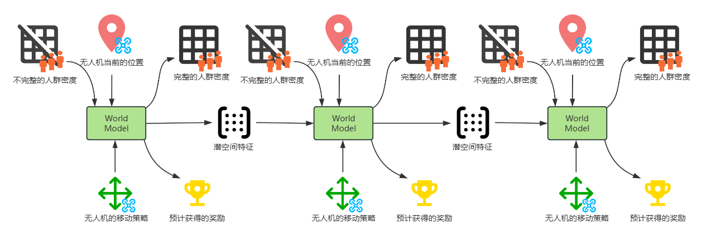
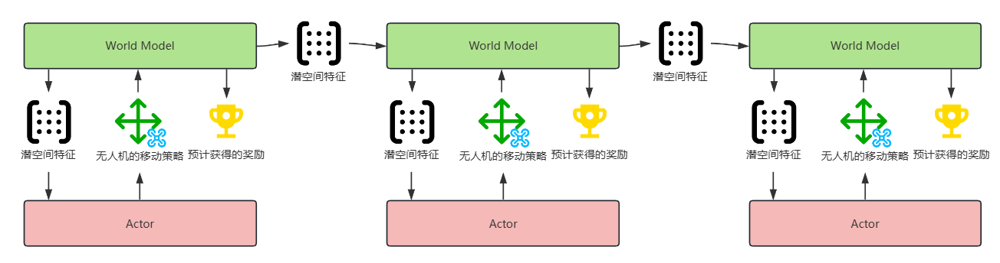
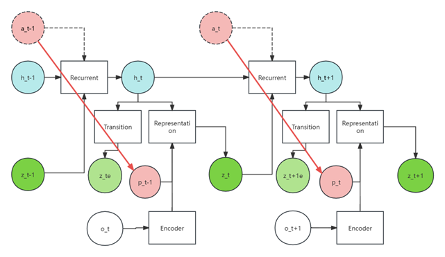
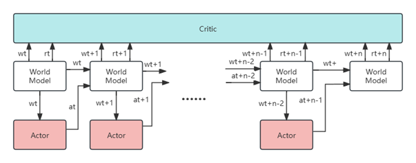

# 预测增强的强化学习的无人机基站动态部署优化

## 第一章 绪论

### 1.1 课题研究背景及意义

### 1.2 国内外研究现状

#### 1.2.1 传统数学规划方法：凸优化与启发式算法

#### 1.2.2 基于强化学习的动态决策方法

## 第二章 无人机动态部署的优化理论与方法

### 2.1 无人机动态部署的基础理论

#### 2.1.1 动态部署的核心目标与性能边界

#### 2.1.2 三维空间约束建模方法

### 2.2 深度强化学习算法框架

#### 2.2.1 值函数方法

#### 2.2.2 策略梯度方法

#### 2.2.3 Actor-Critic架构

#### 2.2.4 预测增强的DRL框架

### 2.3 预测增强的时序建模

#### 2.3.1 显式时序预测模型

#### 2.3.2 潜空间建模与隐式预测

#### 2.3.3 预测增强的联合优化范式

### 2.4 本章小结

## 第三章 LSTM多步预测人群驱动的无人机基站动态部署的PPO滚动优化强化学习框架

### 3.1 引言

### 3.2 无人机基站动态部署系统模型和优化目标

#### 3.2.1 系统模型

#### 3.2.2 优化目标

### 3.3 LSTM多步预测和PPO滚动优化结合的强化学习框架

#### 3.3.1 基于LSTM多步人群移动预测模型

#### 3.3.2 预测驱动的PPO强化学习框架

#### 3.3.3 损失函数

### 3.4 基于贪心策略的用户功率分配优化

### 3.5 实验和结果

## 第四章 潜在空间想象驱动的无人机基站动态部署的Actor-Critic强化学习框架

### 4.1 引言

### 4.2 潜在空间想象驱动的预测强化学习框架

#### 4.2.1 改进的基于RSSM的环境动态想象预测模型

#### 4.2.2 基于想象的Actor-Critic强化学习算法

#### 4.3.3 损失函数

### 4.4 实验和结果

